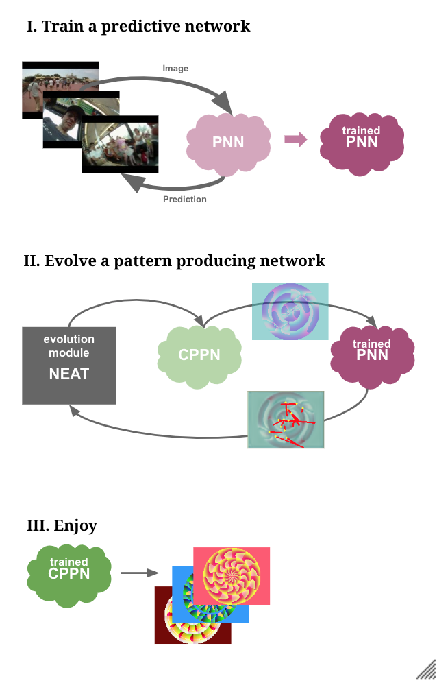
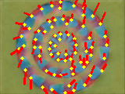
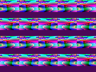
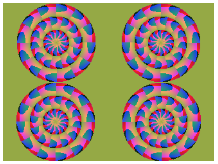

# EIGen: Evolutionary Illusion Generator

## Acknowledgments

This tool relies on a cost function derived from a model built fron the architecture of W. Lotter and al. (https://coxlab.github.io/prednet/), model implemented, improved and trained by E. Watanabe (https://github.com/eijwat/Predictive_Coding_Deep_Neural_Networks, https://www.frontiersin.org/articles/10.3389/fpsyg.2018.00345/full); on the pyTorch implementation of Ken Stanley's NEAT (https://github.com/uber-research/PyTorch-NEAT); and on useful blog posts by David Ha about graphics generation (https://blog.otoro.net/2016/03/25/generating-abstract-patterns-with-tensorflow/)

## Concept

EIGen generates static images that appear to move: motion illusions. It is based on predictive coding:

## Quick Start

Open illusion_generation.ipynb in Colab: https://colab.research.google.com/notebooks/intro.ipynb#recent=true

Run each cell as needed.

## Results

EIGen outputs both the current best pattern and the expected motion vectors.

You can also choose bands:

The algorithm does not stop automatically. Stop it when you are happy with the results or when it's stagnating.
To increase the illusory motion, you can copy-paste the best image several times and flip or mirror it as below:

## I don't see the illusion!!! You're a hack!!!

Not everyone can see illusions. For an average motion illusion, ~25% of people might report seeing something.
Sometimes they are strong, sometimes they are weak. Sometimes the direction reverse depending if your lights are bright or if it's dark. Sometimes you get used to an illusion and it stops working.

The best way to see it is, in my experience:

	Be in a brightly lit environment, with the screen light on max

	Let your eyes wander on the screen or fixate a point in the distance

	Don't stare at the image directly!

Good luck!
